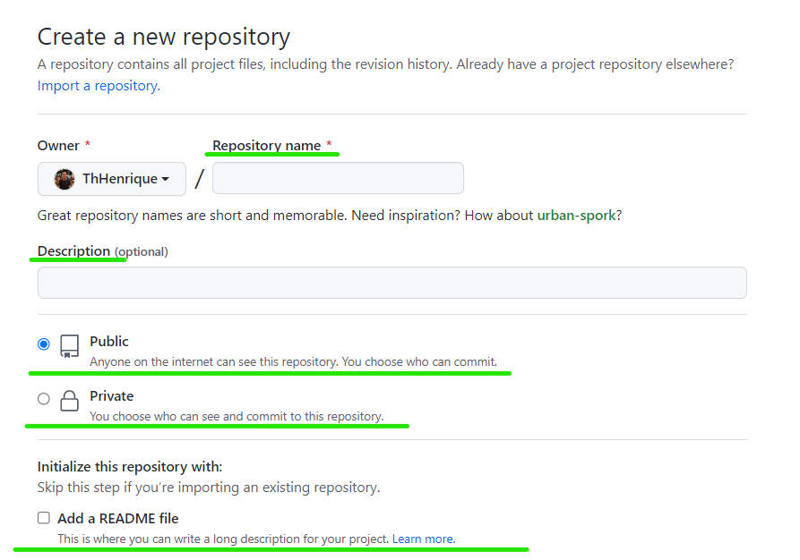
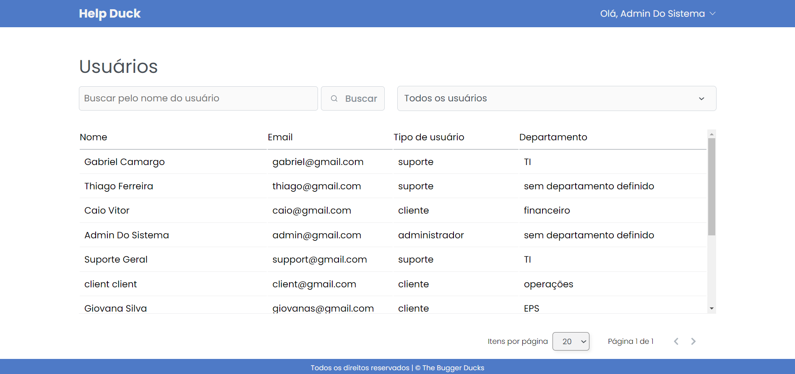
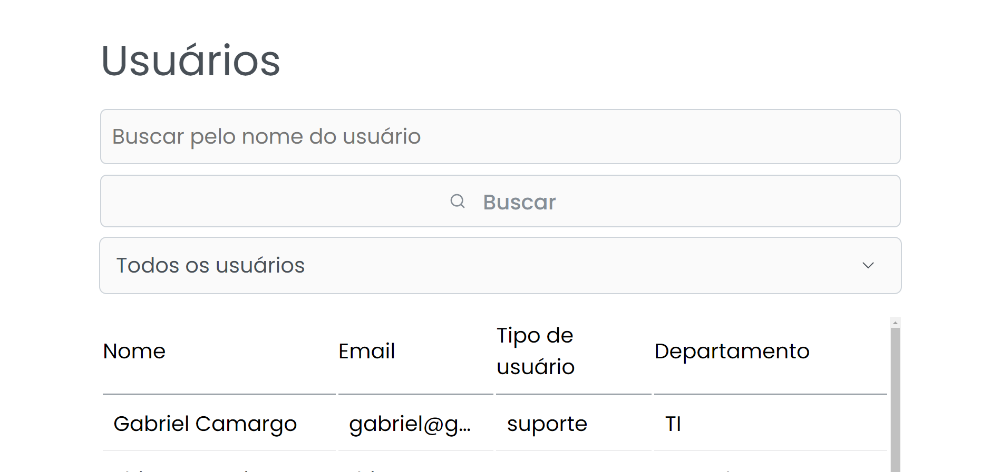
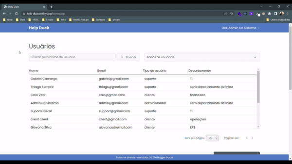
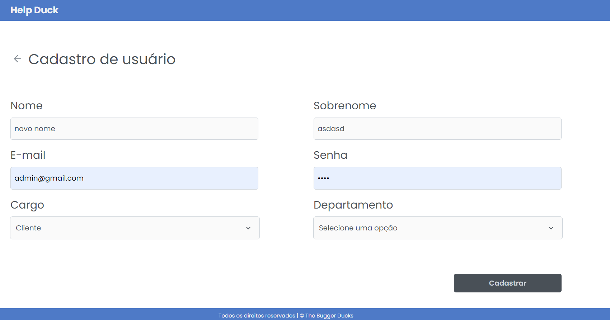
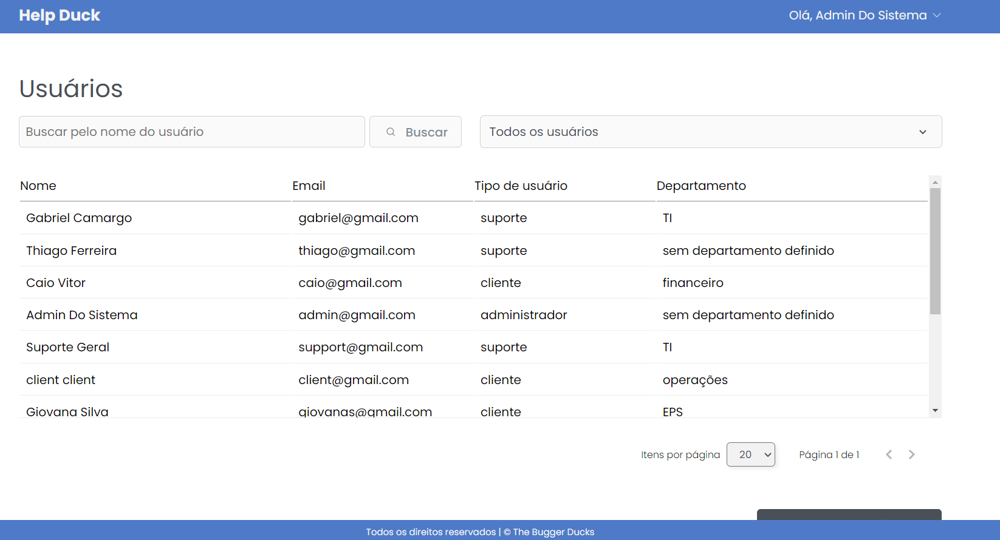
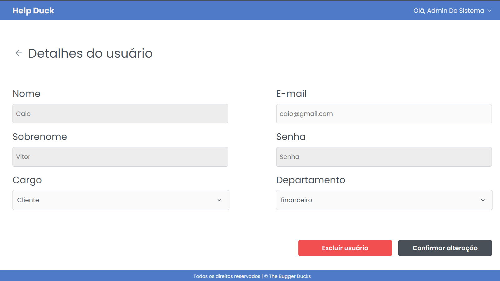
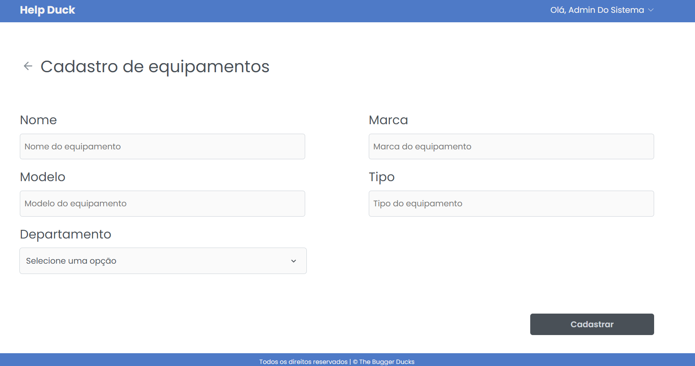

# Heurísticas de Jakob Nielsen

### 1 - Visibility of system status

O sistema deve sempre manter os usuários informados sobre o que está acontecendo, em tempo real, por meio de feedbacks instantâneos dentro de um prazo razoável, que servirão para orientar o usuário sobre o que está acontecendo na tela em que ele se encontra.

Na reprodução de uma mídia no Youtube, por exemplo, o usuário tem total visibilidade do sistema, onde em baixo tem a barra de progresso do vídeo, mostrando quanto da mídia já foi reproduzida, ao lado contém o tamanho da mídia em minutos, e quanto já foi reproduzido, para auxiliar o usuário a entender a barra de progresso. E no centro está contido as informações referentes a mídia que está sendo reproduzida.

### 2 - Match between system and the real world

O sistema deve ter a mesma linguagem que seu usuário utiliza no dia a dia, portanto utilizar palavras, frases, imagens e conceitos que sejam familiares ao usuário. Também é recomendável a utilização de ícones que representem uma ação para realizar essa correspondência.

Por exemplo, os símbolos de media player utilizados em sites de busca de videos e músicas representam as ações de um reprodutor de música do mundo real como rádio, toca discos, vitrola, e ipod.

### 3 - User control and freedom

No sistema é importante que o usuário tenha liberdade para realizar ações que ele deseja, porém muitas vezes essas ações são realizadas por engano, nessas situações deve haver uma “saída de emergência” de fácil localização, permitindo que o usuário saia daquela janela indesejada ou retorne ao ponto anterior.

O Youtube, por exemplo, permite que o usuário cancele a compra de um plano a qualquer momento, portanto o ícone "x" que representando a ação de fechar, permite que o usuário cancele a compra, dando a ele controle sobre a situação.

### 4 - Consistency and standards

Não devemos deixar o usuário em dúvida se palavras, situações ou ações diferentes tem o mesmo significado, para isso a interface deve manter uma consistência, permitindo que o usuário identifique os padrões de estética, interação e informação existentes nesta.

Os sites Youtube e Gmail da Google, por exemplo, seguem padrões, sendo que os itens de pesquisa, logo e perfil ficam sempre na parte superior. No menu lateral esquerdo contém as outras áreas do site onde o usuário realiza uma navegação para ação desejada.

### 5 - Error prevention

Essa heurística foca em criar uma plataforma que busca prevenir que problemas ocorram, eliminando condições mais propensas ao erro, isso pode ser feito sinalizando ações como quando o usuário não finalizou uma tarefa e pede para sair da página ou oferecendo a ele uma opção de confirmação antes de completar uma ação.

Um exemplo disso é uma pesquisa feita no google. Caso o usuário faça uma busca e a mesma conter palavras incorretas o site realiza sua busca, no entanto, sugere que seja feito uma nova busca com as informações já corrigidas por ele.

### 6 - Recognition rather than recall

Devemos minimizar a quantidade de informações que o usuário precisa memorizar, para isso, objetos, ações e opções importantes devem ficar visíveis, isso faz com que o cérebro perceba as ações que são similares, reconhecendo assim padrões.

Os sites de reprodução de músicas e vídeos, por exemplo, costumam seguir padrões em seu layout, tendo a barra de media player fixo no canto inferior da página, no lado direito da página fica uma lista de música que será tocado em seguida e no lado direto em destaque, está contido uma foto/video da mídia que está sendo reproduzida.

### 8 – Aesthetic and minimalist design

Quanto maior a quantidade de informações, mais tempo o usuário vai levar para analisá-las e poder tomar uma decisão, aumentando assim as chances dele abandonar a aplicação/site por achar confuso demais.Portanto o design da interface deve ser minimalista e o conteúdo o mais direto possível, informações que forem secundárias podem ser deixadas em segundo plano, como menus e abas.

O melhor exemplo da heurística de design estético e minimalista, é a home do Google, que é completamente focada, aparecendo somente o necessário ou relevante para melhor proporcionar experiência ao usuário dos usuário

### 9 – Help users recognize, diagnose, and recover from errors

Caso dê algo de errado, é importante mostrar ao usuário qual foi o erro e como se recuperar dele, para isso, as mensagens de erro devem ser claras e objetivas, em linguagem simples e próximas da ação que causou o erro.

Por exemplo, uma pesquisa sem resultados realizada no google, contém um link com dicas para realizar uma pesquisa na plataforma e ainda contém sugestões que possam talvez ajudar o usuário em sua busca.

### 10 – Help and documentation

Nunca sabemos quando um usuário vai precisar de um auxílio, embora as áreas de documentação e ajuda sejam as menos acessadas, elas devem estar lá, principalmente em interfaces que possuem muitas possibilidades, pois podem ajudar o usuário a resolver um problema sozinho.  

O site do Google, por exemplo, possui um site especifico apenas para suporte que permite aos usuários pesquisarem seu problema ou verem os principais tópicos e suas respectivas soluções, podendo assim resolver seu problema.  

---

# WCAG

### 1.3.5 - Identificar o objetivo de entrada

As pessoas devem ter clareza do que devem preencher em campos de formulários. 

Com isso os campos de entrada de um formulário (input) deve ter seu atributo definido corretamente, sendo eles: checkbox, color, date, email, file, number, password, text,  entre outros.

Com o atributo type do input definido corretamente, é essêncial que este campo venha acompanhado com um texto para auxílio, para que o usuário não fique perdido.

Na criação de um repositório no gitHub, por exemplo, todos os campos que devem ser preenchidos, contém o símbolo * em vermelho e, caso o campo não seja obrigatório aparece o texto opicional. Os campos são acompanhados com texto de auxílio, alguns são acompanhados também de ícones que rementem ao usuário coisas de seu cotidiano como o cadeado, mostrando que o local terá algum tipo de segurança.

### 1.4.4 - Redimensionar texto

Ao se aplicar zoom de até 200% na tela, deve ocorrer a responsividade dos textos apresentados de forma que sua leitura e legibilidade continuem adequados sem qualquer quebra na apresentação das informações.

- Zoom (100%)
  

- Zoom (200%)
  

Em nosso API com o zoom no nível 200, todos os elementos continuaram visíveis sem a quebra de layout.

### 2.1.1 - Teclado

Todas as funcionalidades devem ser acionadas via teclado, a menos que a funcionalidade não possibilite o controle apenas por teclado.

Em nosso API todas as funcionalida

### 2.4.2 - Página com título

Todas as telas devem ter um título principal e que descreva claramente a sua finalidade.

- Pages
 

